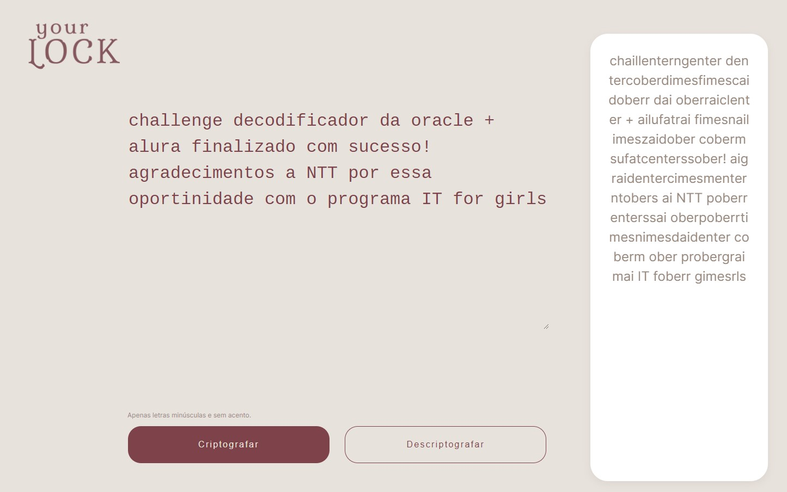
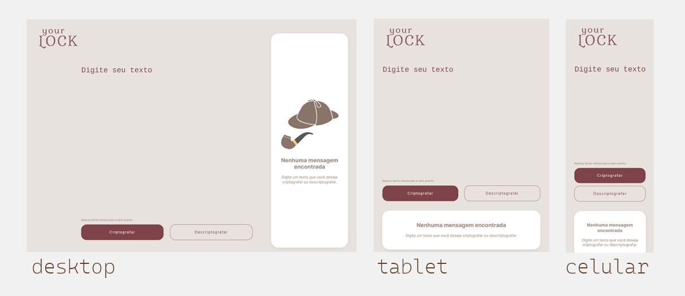
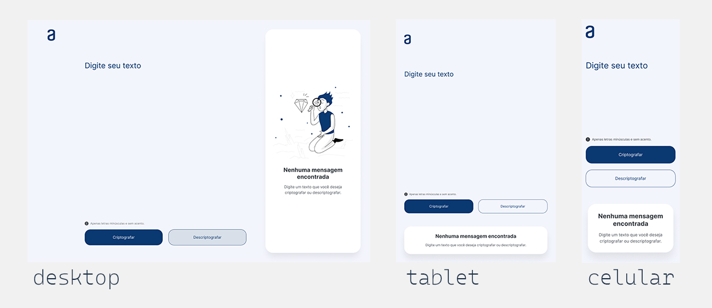

# Challenge Decodificador 💻

Este projeto foi o primeiro challenge do programa da ONE da Oracle 🧡, da Turma 6, que pude participar graças a iniciativa da NTT IT for Girls 💙. O desafio era criar uma aplicação que criptografa e descriptografa textos de acordo com algumas chaves passadas.
Este foi o meu primeiro contato com Javascript, e foi muito gratificante já ver sua aplicação com HTML e CSS.

## ✔ Requisitos
- Deve funcionar apenas com letras minúsculas
- Não devem ser utilizados letras com acentos nem caracteres especiais
- Deve ser possível converter uma palavra para a versão criptografada e também retornar uma palavra criptografada para a versão original.
- A página deve ter campos para inserção do texto a ser criptografado ou descriptografado, e a pessoa usuária deve poder escolher entre as duas opções
- O resultado deve ser exibido na tela.

## 🖌️ Figma

Foi passado um modelo de Figma como ponto de partida para o layout, considerando a responsividade para diferentes aparelhos, e sua alteração foi permitida/encorajada.
Meu conceito foi não mudar drasticamente a estrutura, mas alterar a paleta de cores para um conceito de "detetive", já que mensagens criptografadas são de um universo literário comum 🔍

Imagens do figma passado pelo enunciado:

## ⤴️ Pontos de Melhoria
- Ainda não consegui implementar o botão de copiar o texto, proposto como extra.
